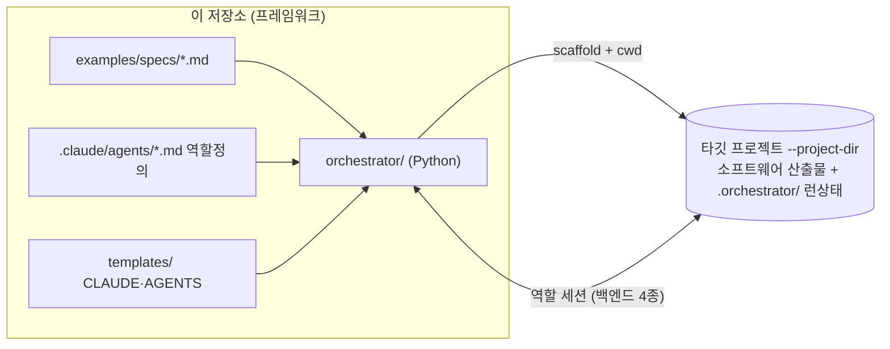
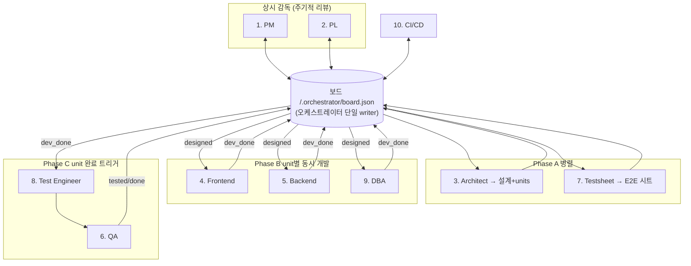

# 멀티 에이전트 · 멀티 백엔드 소프트웨어 빌드 오케스트레이터 (프레임워크)

> 원격 ultraplan 세션이 승인 직전까지 확정한 **정본 플랜**. (사용자 제공 원문)

## Context (왜 / 무엇을 만드는가)

**이 저장소 = 멀티에이전트 코드(프레임워크) 저장소다.** 이 저장소 자체가 산출물이 되는 게 아니라,
여기 들어있는 멀티에이전트 코드가 **별도의 새 프로젝트 디렉터리(타깃)** 에 소프트웨어(웹·앱·서비스·CLI 등)를 만들어낸다.
즉 오케스트레이터는 재사용 가능한 도구이고, 실행할 때마다 `--project-dir <타깃>`을 받아 그 안에 산출물을 생성한다.

가상 개발팀은 11개 역할 에이전트로 구성된다.
- PM/PL(1·2)은 **상시 감독**, 아키텍트(3)가 설계하면 개발 3인(4·5·9)이 **동시에** 구현하고,
  개발 단위가 끝날 때마다 테스트 3인(6·7·8)이 테스트시트/테스트코드로 검증한다.
- 핵심 요구: "상시 감독" + "각 에이전트 동시 실행" + "개발 단위별 완료 시 테스트 트리거".

**확정된 결정(사용자):**
- 하이브리드(서브에이전트 정의 + SDK 오케스트레이터) / 구현 언어 = Python.
- **이 저장소는 프레임워크**, 산출물(소프트웨어)은 별도 타깃 프로젝트 디렉터리에 생성.
- 산출물 범위 = **실행 가능한 오케스트레이터**.
- **백엔드 4종 모두 지원**: ① Claude Agent SDK ② OpenAI Agents SDK ③ Claude Code 구독 ④ Codex(OpenAI) 구독.

백엔드 4종은 본질적으로 **2×2** — (제공자 Anthropic↔OpenAI) × (방식 API키 SDK ↔ 구독형 에이전트 CLI).
따라서 핵심 설계는 **역할 실행을 백엔드 뒤로 추상화**하고, 오케스트레이션 로직은 백엔드·타깃과 무관하게 둔다.

| | API키 SDK | 구독형 CLI |
|---|---|---|
| Anthropic | Claude Agent SDK | Claude Code (`claude -p`) |
| OpenAI | OpenAI Agents SDK | Codex (`codex exec`) |

## 구현 기반 (검증된 사실)

**① Claude Agent SDK** — `pip install claude-agent-sdk`. `query(prompt, options)`. `ClaudeAgentOptions(system_prompt, allowed_tools, permission_mode, cwd, model, max_turns, max_budget_usd, setting_sources)`. 인증 `ANTHROPIC_API_KEY`(구독 자동 폴백 X). 비용 `ResultMessage.total_cost_usd`.

**③ Claude Code 구독(CLI)** — `claude -p "<prompt>" --output-format stream-json --append-system-prompt "<role>" --allowedTools "Read,Write,Edit,Bash" --permission-mode acceptEdits --model <m>` (cwd=타깃에서 실행). 결과는 단일 JSON blob 이 아니라 **stream-json**(JSONL) 스트림으로 나오므로, 마지막 `result` 타입 이벤트에서 `result`/`session_id`/`total_cost_usd` 를 파싱한다. `ANTHROPIC_API_KEY` 미설정 시 로그인 구독 사용. cwd의 `CLAUDE.md` 자동 로드.

**② OpenAI Agents SDK** — `pip install openai-agents`. `from agents import Agent, Runner, function_tool`. `Agent(name, instructions=<role>, model, tools=[...])`, `await Runner.run(agent, "<prompt>")` → `result.final_output`. 인증 `OPENAI_API_KEY`. 내장 파일/배시 툴 없음 → `read_file/write_file/edit_file/list_dir/run_bash`를 `@function_tool`로 직접 제공(**타깃 디렉터리로 경로 스코프 한정**). 결과 JSON 은 별도 전용 툴(`write_result`)이 아니라 **프롬프트 계약**으로, 역할이 `write_file` 로 `.orchestrator/results/<role>__<unit>.json` 에 직접 기록한다.

**④ Codex 구독(CLI)** — `codex exec "<prompt>" --cd <타깃> --model <m> --sandbox workspace-write --json -o <out> --skip-git-repo-check`(타깃이 git 아닐 수 있음 → 플래그 필수). 시스템 프롬프트 플래그 없음 → 역할 프롬프트를 prompt에 prepend + 공유 지침은 타깃의 `AGENTS.md` 자동 로드. 인증 `codex login`(ChatGPT 구독) 또는 `CODEX_API_KEY`.

**공통 동시성**: 역할 세션을 `asyncio.gather`/`create_task` 병렬. CLI 백엔드는 `asyncio.create_subprocess_exec`.

## 크로스-백엔드 조정 계약 (핵심)

4종이 공통 보장하는 능력(=cwd 안 파일 편집)만 사용한다.
- **오케스트레이터가 보드의 단일 writer.** 보드/런상태는 **타깃 프로젝트의 `<project-dir>/.orchestrator/`** 에 둔다(런 자체완결, 타깃 `.gitignore`로 제외).
- 각 역할 디스패치 시 프롬프트 합성 = [공유 프로토콜은 타깃의 CLAUDE.md/AGENTS.md에 이미 존재] + [작업 지시: 대상 unit, 산출물 경로, PM/PL 디렉티브, "결과를 `.orchestrator/results/<role>__<unit>.json`에 기록하라"].
- 역할 세션은 **타깃 repo** 파일을 편집하고 결과 JSON(`{status, artifacts, notes, blockers}`)을 남긴다.
- 오케스트레이터가 결과 파일을 읽어 검증→보드 갱신→`events.log` 기록→다음 단계 구동.
- supervisor(PM/PL)도 백엔드 무관 **주기적 1-shot 리뷰**(매 tick=현재 보드+최근 이벤트 1회 호출→디렉티브 산출). Claude SDK는 옵션으로 `ClaudeSDKClient` 영속 세션 가능하나 베이스라인은 1-shot.
- (계획/미구현) Claude Agent SDK 한정 board MCP 툴 강화는 **아직 구현하지 않았다.** 현재 구현은 4종 모두
  결과파일 계약(`.orchestrator/results/<role>__<key>.json`)으로만 조정한다.

## 아키텍처

프레임워크 → 타깃:

팀 워크플로우(페이즈, 타깃 안에서 진행):

백엔드 라우팅: 스케줄러 → 백엔드 라우터(역할별/전역 선택) → {Claude Agent SDK | Claude Code CLI | OpenAI Agents SDK | Codex CLI | mock} → 역할 세션(타깃 편집+result 파일) → 스케줄러.

## 디렉터리/파일 (이 프레임워크 저장소에 생성)

산출물(소프트웨어) 코드는 이 저장소에 **들어오지 않는다.** 여기엔 프레임워크만.

### 1) 역할 정의 — `.claude/agents/*.md` (하이브리드 축, 프롬프트 단일 출처)
frontmatter(`name`,`description`,`tools`,`model`)+본문. 오케스트레이터가 본문을 읽어 모든 백엔드 역할 프롬프트로 주입(Claude SDK=`system_prompt`, Claude CLI=`--append-system-prompt`, OpenAI=`instructions`, Codex=prepend). 대화형 Claude Code에서도 재사용.
11개: `project-manager`, `project-leader`, `architecture-engineer`, `frontend-developer`, `backend-developer`, `dba`, `testsheet-creator`, `test-engineer`, `qa`, `cicd`, `docs-writer`. 최소권한 `tools`, Agent 툴 미부여.

### 2) 공유 지침 템플릿 — `templates/CLAUDE.md`, `templates/AGENTS.md`
오케스트레이터가 타깃 스캐폴딩 시 spec 컨텍스트와 함께 타깃 루트에 기록 → CLI 백엔드(claude/codex)가 cwd에서 자동 로드. 내용: 타깃 레이아웃, **결과파일 조정 프로토콜**, 코딩 컨벤션, 선택된 스택. 두 생태계 규약 동시 제공.

### 3) 샘플 입력 — `examples/specs/sample-spec.md`
즉시 돌릴 작은 샘플 기획서(예: 태스크/메모 보드 — 웹 예시). 스택은 가정하지 않으며 **아키텍트가 spec 기반으로 결정**한다(웹이라면 예: FastAPI + React/Vite + SQLite). 다른 도메인(앱·CLI·서비스)도 동일.

### 4) 오케스트레이터 — `orchestrator/` (Python 패키지)
- `__main__.py` — `python -m orchestrator`. 주요 인자: `--spec`, `--project-dir`(타깃), `--backend`, `--backends`, `--distribute`, `--cross-check`, `--role-backend role=backend[,fallback]`, `--max-units`, `--concurrency`, `--budget`, `--model`, `--poll-interval`, `--delegate`, `--max-attempts`, `--retries`, `--timeout`, `--mock`, `--check`, `--watch`, `--interval`, `--web`, `--port`, `--host`, `--base-dir`.
- `config.py` — 경로/기본값, 역할→(타입, 페이즈, 툴셋, 기본 모델, 기본 백엔드) 매핑.
- `workspace.py` — 타깃 스캐폴딩: 디렉터리 생성, 템플릿→타깃 CLAUDE.md/AGENTS.md 기록, `.orchestrator/` 초기화, 타깃 `.gitignore` 시드.
- `board.py` — `<project-dir>/.orchestrator/board.json` 원자적 read/write(`asyncio.Lock`), `events.log`/`directives.md`. units 상태기계 `todo→designing→designed→in_progress→dev_done→testing→tested→done`(+`blocked`).
- `agents.py` — `.claude/agents/*.md` 파서(`pyyaml`) → 역할 프롬프트/툴/모델.
- `prompts.py` — 역할+unit+디렉티브+결과경로로 작업 프롬프트 합성.
- `backends/base.py` — `Backend` 프로토콜: `async def run_role(*, role, system_prompt, prompt, cwd, allowed_tools, model, max_turns, budget) -> RoleResult{final_message, cost_usd, raw}` + `available()`.
- `backends/claude_sdk.py` / `claude_cli.py` / `openai_agents.py` / `codex_cli.py` / `mock.py` / `__init__.py`(이름→팩토리 + 가용성).
- `runner.py` — 결과파일 계약 실행(백엔드 호출→결과 파싱→보드 갱신).
- `scheduler.py` — asyncio 본체: 타깃 스캐폴딩 → 보드 초기화 → PM/PL 주기 루프 `create_task` → Phase A `gather(architect, testsheet)` → unit별 `process_unit()` `Semaphore(concurrency)`(dev 3인 `gather`→dev_done→test_engineer→qa→done). test-engineer 실패 시 QA 를 건너뛰고 dev 재작업으로 돌아가며, Phase D `cicd` 후 Phase E `docs-writer` 를 실행하고 graceful shutdown 한다.

### 5) 패키징/위생
- `pyproject.toml` — deps: `pyyaml`; extras `[claude]`=claude-agent-sdk, `[openai]`=openai-agents (일부만 설치 가능); `[project.scripts] dev-crew`.
- `.gitignore`(프레임워크) — `__pycache__/`, `.venv/`, `runs/`.
- `README.md` — 백엔드별 전제조건/설치/실행/안전장치, 프레임워크↔타깃 개념.

## 안전장치
- 세션별 `max_turns`+예산, 전역 동시성 `Semaphore`, `--max-units`. Claude `permission_mode=acceptEdits`(헤드리스 `bypassPermissions`), Codex `--sandbox workspace-write`, OpenAI는 노출 function_tool로만 스코프(파일 툴은 **타깃 cwd 한정**). 중첩 서브에이전트 금지. 타깃 경로는 절대경로로 정규화·탈출 방지.
  - ⚠️ **실제 구현 주의(#16/#73)**: OpenAI Agents 의 `run_bash` 는 `shell=True` 이며 `cwd` 만 타깃으로
    설정한다. 셸 자체는 FS 경계를 강제하지 않으므로 "인자 안전처리로 커맨드 인젝션 방지" 같은 강한 보장은
    **없다.** Bash 권한을 가진 역할만 노출되며, 강한 격리가 필요하면 Docker 컨테이너로 실행한다.
  - ⚠️ **의존성-설치 금지 정책은 "프롬프트 한정" 강제(#48/#9)**: `templates/CLAUDE.md`·`templates/AGENTS.md`
    는 역할에게 "의존성 설치/번들 빌드 금지"를 지시하지만, 런타임은 developer/test/cicd/docs 역할에
    여전히 Bash 를 노출한다. 따라서 이 금지는 **모델 프롬프트로만 강제**되며 CLI/SDK 백엔드에서 에이전트가
    무시하고 `pip`/`npm`/build 를 실행할 수 있다. **실제 차단(진짜 격리)이 필요하면** 백엔드 자체의
    샌드박스(예: `codex --sandbox workspace-write`)나 Docker 컨테이너 실행에 의존해야 한다.

## 검증 (end-to-end)
전제조건(백엔드별): ① `claude-agent-sdk`+`ANTHROPIC_API_KEY` ② `claude` CLI 로그인 ③ `openai-agents`+`OPENAI_API_KEY` ④ `codex` CLI 로그인. Python 3.10+, 네트워크.

1. **백엔드 진단** — `python -m orchestrator --check` → 4종+mock 가용성 표.
2. **무비용 스모크** — `python -m orchestrator --spec examples/specs/sample-spec.md --project-dir /tmp/demo-web --mock`
   기대: `/tmp/demo-web` 스캐폴딩(CLAUDE.md/AGENTS.md/.orchestrator/) → PM/PL 기동 → Phase A→B→C → `board.json` units `done`까지, `events.log`/결과파일/플레이스홀더 생성. (키 없이 오케스트레이션이 실제로 돈다 확인)
3. **실모드 데모(가용 백엔드)** — `python -m orchestrator --spec examples/specs/sample-spec.md --project-dir /tmp/demo-web --backend claude-cli --max-units 2 --concurrency 3 --budget 5` 또는 혼합 `--role-backend frontend-developer=codex --role-backend backend-developer=openai-agents`.
   기대: 선택된 unit 에 `docs/design/*`, `docs/test/*-e2e.md`, `backend/`·`frontend/`·`db/` 코드, 테스트+QA 로그, 보드 unit별 `dev_done→tested→done`. `--max-units` 로 처리하지 않은 unit 이 있으면 전체 phase 는 경고/실패로 끝날 수 있다.
4. `.claude/agents/*.md` 대화형 확인(하이브리드 다른 축).

## 가정
- 기본 스택(FastAPI+React/Vite+SQLite) 합리적 기본값, config/spec에서 교체 가능(아키텍트 재정의 가능).
- "구독형"은 해당 CLI 로그인 가정. 미가용 백엔드는 `--check`/실행 시 명확히 에러·스킵.
- 타깃 `--project-dir`는 새 디렉터리 권장. 기존 디렉터리면 그 위에 산출물 추가.
  - **CLAUDE.md/AGENTS.md 갱신 정책(#40/#141, 현재 동작):** 스캐폴딩은 이 두 파일의 본문 맨 앞에
    생성 마커(`<!-- orchestrator-generated -->`)를 박는다. **마커가 있으면(=오케스트레이터가 생성한 파일)
    매 런마다 현재 spec/스택으로 새로 갱신(refresh)** 하고, **마커가 없으면(=사용자가 직접 작성한 파일)
    덮어쓰지 않고 보존**한다. 즉 *생성 파일은 갱신, 사용자 파일은 보존*. (`.claude/agents/*` 노출과
    `.orchestrator/spec.md` 는 항상 현재 내용으로 재기록.)

## 구현 현황 (정본 대비 추가)

정본 설계를 모두 구현하고, 다음을 추가했다:

- **Team Agents 양방향 활용** — ① `claude-team` 백엔드(리드 세션이 `Task`로 역할 서브에이전트 네이티브 디스패치) ② `--delegate`(역할 세션이 동료를 서브에이전트로 위임, 깊이 1). 스캐폴딩 시 `.claude/agents/*.md`를 타깃에 노출하고, claude-sdk 는 `ClaudeAgentOptions(agents=...)` 주입.
- **프로덕션 하드닝** — 전이성 실패 재시도(`--retries`, 백오프), QA 실패 시 dev→test→qa 재작업 루프(`--max-attempts`), 결과 JSON 스키마 보정, SIGINT/SIGTERM 그레이스풀, 비용 집계(`total_cost_usd`), `.orchestrator/report.md` 생성.
  - **재실행(rerun) 동작 차이(의도된 설계):** TUI 모니터의 rerun(`monitor.py::_rerun`)은 `rerun.json` 의 argv 로
    **같은 project-dir 안에서 이어서 재실행**(in-place)한다. 반면 웹 UI 의 rerun(`webui.py`)은 `_run_opts.json`
    을 바탕으로 **새 run 을 생성**(별도 run 디렉터리)한다. 둘의 의미가 다른 것은 의도된 것이며(TUI=현장 즉시 재개,
    웹=이력 보존형 새 실행), 운영자가 놀라지 않도록 명시해 둔다.
- **검증/품질** — pytest 스위트(`tests/`, mock 기반·무비용, 현재 600+ 케이스로 확장), ruff 린트/포맷,
  GitHub Actions CI(3.10–3.12 매트릭스, `python -m pytest -q` 로 실행).
- **실모드 데모 확인** — `claude-cli` 로 실제 LLM 호출까지 end-to-end 동작 검증(설계 문서·DB 스키마 등 실제 산출물 생성).
